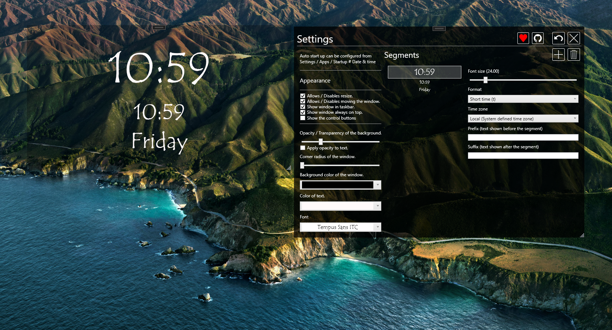

    

<h1 align="center">
  Time
</h1>

  A small application for displaying the time on the desktop. With Windows 11 for what ever reason the time and date is once AGAIN no longer is shown on secondary screens.
 Not sure if there are others / other apps which do the exactly same thing, in any case if your in the same boat, give it shot.

    

    

